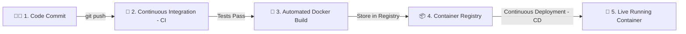
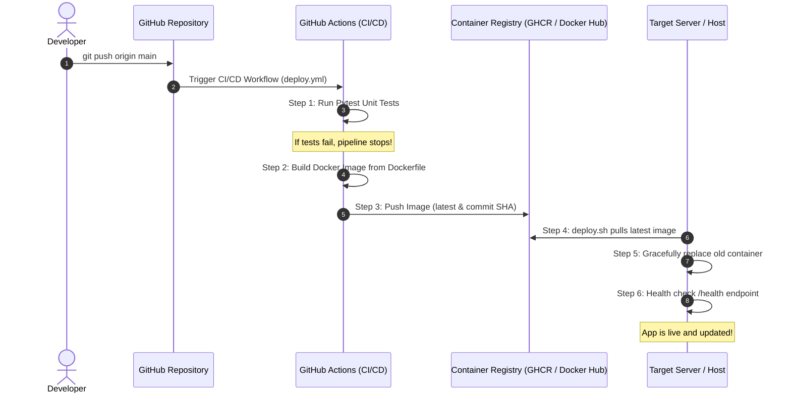

# 📚 How Automated Docker Deployment Works (Beginner's DevOps Guide)

Welcome to the beginner-friendly guide to **Automated Docker Deployment** and **CI/CD (Continuous Integration / Continuous Deployment)**.

---

## 1. What is Docker and Why Do We Use It?

### The "It Works on My Machine" Problem
In traditional software development, an application might work perfectly on a developer's laptop, but fail completely when moved to a server. This happens due to:
- Different operating system versions (Windows vs Linux vs macOS).
- Missing dependencies or wrong software versions (e.g., Python 3.9 vs 3.12).
- Different environment variables or system configurations.

### The Solution: Docker Containers
**Docker** packages an application together with everything it needs to run:
- The code (`app.py`)
- The runtime environment (`Python 3.11`)
- The dependencies (`Flask`, `pytest`)
- The system libraries and configuration

> 💡 **Analogy:** Think of Docker like a standard cargo shipping container. Whether it's loaded onto a ship, train, or truck, the container is always the exact same shape and contains everything inside. A Docker container runs identically on your laptop, a teammate's computer, or an AWS/cloud server.

---

## 2. What is CI/CD?

In DevOps, **CI/CD** automates the manual work of testing, building, and deploying software.



### 1. Continuous Integration (CI)
Every time a developer pushes code or opens a Pull Request:
- An automated server (like **GitHub Actions**) spins up a clean environment.
- It downloads the code and installs dependencies.
- It runs automated tests (`pytest`).
- If any test fails, the pipeline **stops immediately** and alerts the developer before broken code reaches users.

### 2. Continuous Delivery / Deployment (CD)
Once the tests pass:
- The pipeline builds a new Docker container image.
- It pushes the image to a container registry (**GitHub Container Registry (GHCR)** or **Docker Hub**).
- The deployment script pulls the latest image onto the production server and restarts the container with zero hassle.

---

## 3. Step-by-Step: The Automated Deployment Lifecycle

Here is exactly what happens behind the scenes from the moment you write code:



---

## 4. Line-by-Line Breakdown of Project Components

### A. The Web Application (`app.py`, `templates/`, `static/`)
A pure Python Flask web app cleanly separated from frontend markup and styles:
- **`app.py`**: Pure Python handling routing, server startup, and metadata.
- **`templates/index.html`**: HTML dashboard template displaying container hostname, version, and status.
- **`static/style.css`**: CSS stylesheet for modern styling.
- **Health Check Endpoint (`/health`)**: Returns `{"status": "healthy"}`. In modern DevOps, orchestration tools and load balancers ping this URL every few seconds to verify the container is alive.

### B. The `Dockerfile`
A recipe that tells Docker how to build the container image:

```dockerfile
# 1. Start from a lightweight official base image
FROM python:3.11-slim

# 2. Optimize Python output for container logs
ENV PYTHONDONTWRITEBYTECODE=1
ENV PYTHONUNBUFFERED=1

# 3. Create a working folder inside the container
WORKDIR /app

# 4. Copy and install dependencies first (leverages Docker layer cache)
COPY requirements.txt .
RUN pip install --no-cache-dir -r requirements.txt

# 5. Copy the rest of the application code
COPY . .

# 6. Inform Docker that the app listens on port 5000
EXPOSE 5000

# 7. Built-in healthcheck instruction
HEALTHCHECK --interval=30s --timeout=5s --start-period=5s --retries=3 \
  CMD python -c "import urllib.request; urllib.request.urlopen('http://localhost:5000/health')" || exit 1

# 8. Command to execute when the container starts
CMD ["python", "app.py"]
```

### C. The Automated Unit Tests (`test_app.py`)
Ensures that any breaking changes (like a typo breaking the home page or health endpoint) are caught in the CI pipeline before building a Docker image.

### D. The CI/CD Pipeline (`.github/workflows/deploy.yml`)
The GitHub Actions workflow automates the entire process:
- **`test` Job**: Runs on Ubuntu virtual machine, sets up Python, installs dependencies, and runs `pytest test_app.py`.
- **`build-and-push` Job**: Runs only if `test` passes and code was pushed to `main`. Uses Docker Buildx to build and push the container image to GitHub Container Registry (`ghcr.io`).
- **`deploy` Job**: Completes the continuous deployment stage.

### E. The Deployment Script (`deploy.sh` / `deploy.ps1`)
The script running on the server:
1. `docker pull`: Fetches the newly built image.
2. `docker stop & rm`: Gracefully shuts down the old version.
3. `docker run -d --restart unless-stopped`: Starts the new container in the background.
4. **Health Check Loop**: Polls `http://localhost:5000/health` up to 10 times to verify the new container started successfully.

---

## 5. Key DevOps Benefits

| Feature | Manual Deployment | Automated Docker Deployment |
| :--- | :--- | :--- |
| **Speed** | 30–60 minutes manual work | 1–2 minutes automatically |
| **Human Error** | High (forgotten commands, missed steps) | Zero (reproducible script/pipeline) |
| **Consistency** | "Works on my machine" issues | Identical container everywhere |
| **Safety** | Broken code might go live | CI tests catch bugs before deployment |
| **Rollback** | Difficult and stressful | One-command rollback to previous image tag |
