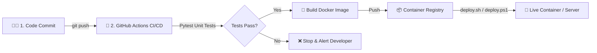

# 🐳 Automated Docker Deployment (Beginner DevOps Project)

[](https://github.com/Mo-Ashad/Automated-Docker-Deployment/actions/workflows/deploy.yml)
[](https://www.docker.com/)
[](https://www.python.org/)
[](LICENSE)

A beginner-friendly DevOps project demonstrating end-to-end **Automated Docker Deployment** and **CI/CD (Continuous Integration & Continuous Deployment)** using GitHub Actions, Docker, and Python Flask.

---

## 📌 Architecture & How It Works



> 📖 **Want a detailed explanation of how everything works?** Check out [EXPLANATION.md](EXPLANATION.md) for a deep-dive beginner guide into Docker, CI/CD, and DevOps!

---

## 📁 Project Structure

```
Automated-Docker-Deployment/
├── app.py                  # Python Flask web application with healthcheck & dashboard
├── test_app.py             # Automated unit tests run by CI
├── Dockerfile              # Well-commented Dockerfile for containerization
├── docker-compose.yml      # 1-command local container runner
├── requirements.txt        # Minimal dependencies (Flask, Pytest)
├── deploy.sh               # Automated deployment script for Linux / macOS / Git Bash
├── deploy.ps1              # Automated deployment script for Windows PowerShell
├── .github/
│   └── workflows/
│       └── deploy.yml      # GitHub Actions automated CI/CD workflow
├── .dockerignore           # Files excluded from the Docker build context
├── .env.example            # Sample environment variables
├── README.md               # Project documentation & quickstart
└── EXPLANATION.md          # Step-by-step beginner guide to DevOps & Docker
```

---

## 🚀 Quick Start Guide

### Option 1: Run Locally with Python (Without Docker)

1. **Install dependencies:**
   ```bash
   pip install -r requirements.txt
   ```

2. **Run the automated unit tests:**
   ```bash
   pytest test_app.py
   ```

3. **Start the application:**
   ```bash
   python app.py
   ```

4. Open your browser and navigate to: **`http://localhost:5000`**
   - Health check endpoint: **`http://localhost:5000/health`**
   - API info endpoint: **`http://localhost:5000/api/info`**

---

### Option 2: Run with Docker

1. **Build the Docker image:**
   ```bash
   docker build -t automated-docker-app .
   ```

2. **Run the container:**
   ```bash
   docker run -d -p 5000:5000 --name automated_docker_app automated-docker-app
   ```

3. **Check container status & logs:**
   ```bash
   docker ps
   docker logs automated_docker_app
   ```

---

### Option 3: Run with Docker Compose

Start the whole application with a single command:
```bash
docker compose up -d
```

To stop:
```bash
docker compose down
```

---

## 🔄 Automated Deployment Scripts

To simulate an automated redeployment (pulling the latest image, stopping the old container, launching the new container, and verifying health):

- **On Linux / macOS / Git Bash:**
  ```bash
  chmod +x deploy.sh
  ./deploy.sh
  ```

- **On Windows (PowerShell):**
  ```powershell
  .\deploy.ps1
  ```

---

## 🐙 CI/CD with GitHub Actions

The repository includes a pre-configured GitHub Actions workflow in [`.github/workflows/deploy.yml`](.github/workflows/deploy.yml):

1. **Continuous Integration (CI)**:
   - Triggers on every `git push` or Pull Request to the `main` branch.
   - Installs Python 3.11 and runs automated tests with `pytest`.

2. **Continuous Deployment (CD)**:
   - If tests pass, builds the Docker image.
   - Pushes the image to **GitHub Container Registry (GHCR)** tagged with `latest` and the commit SHA.

---

## 📄 License
This project is open-source and available under the [MIT License](LICENSE).
